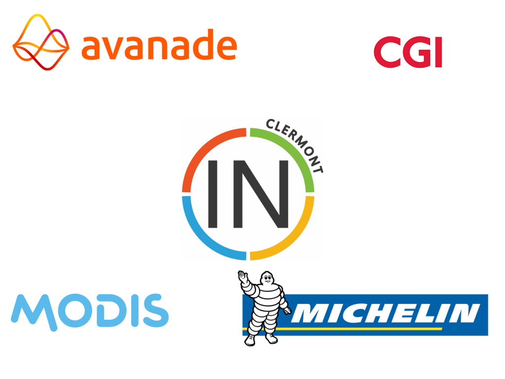

#HSLIDE

#HSLIDE
### Mug In Clermont - M1-2017
#### 13 Juin 2017

#HSLIDE
### Quoi ?
Des conférences techniques autour des technologies Microsoft

du .Net, du Typescript, des outils, des expériences

#HSLIDE
### L'équipe
Kevin, Sylvain, Pierre, Damien, Jérôme

#HSLIDE
## Fréquence ?
Tous les 2 mois si les sujets le permettent

#HSLIDE 
### Qu'avons-nous au menu ?
Retours sur les annonces de la #Build 2017  
(10-12 Mai 2017)

#HSLIDE 
### Qu'avons-nous au menu ?
Dévelopment Mobile multi-plateformes avec Xamarin 

#HSLIDE 
### Et après ? 
     Azure ?
     NodeJS ?
     .NETCore ?
#### A vous de votez : 
Rendez-vous sur notre meetup dès ce soir pour choisir les sujets qui vous interessent le plus...

#HSLIDE
##Plus d'infos
* Notre Meetup : https://www.meetup.com/fr-FR/MugInClermont
* Notre site : http://muginclermont.azurewebsites.net
* Notre mail: muginclermont@outlook.com
* Notre twitter: @muginclermont

#HSLIDE
# #Build 2017 et Xamarin 
Présenté par 
### Jean-Sébastien DUPUY 
#### Technical evangelist - Mobile & IoT
