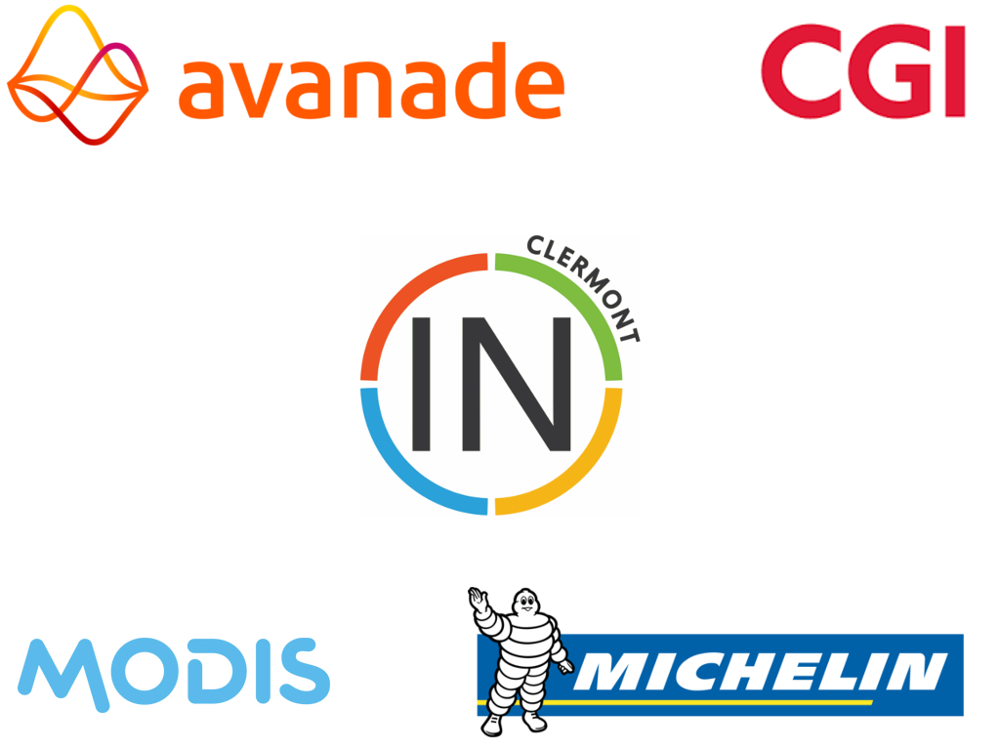

#HSLIDE

### Mug In Clermont - M1-2017
#### 13 Juin 2017

#HSLIDE
### Quoi ?
Des conférences techniques autour des technologies Microsoft

du .Net, du Typescript, des outils, des expériences

#HSLIDE
### L'équipe
Kevin, Sylvain, Pierre, Damien, Jérôme

#HSLIDE
## Fréquence ?
Tous les 2 mois si les sujets le permettent

#HSLIDE
### Où ?
Salle de conférence du Bivouac  
22 allée Alan Turing, 63000 Clermont-Ferrand

#HSLIDE
## Public visé
Tous les étudiants en informatiques, les professionnels utilisant les technologies Microsoft.

#HSLIDE
# Xamarin 
## Le 13 juin 2017 à 18H30
Présenté par 
### Jean-Sébastien DUPUY 
#### Technical evangelist - Mobile & IoT

#HSLIDE
##Plus d'infos
* Notre Meetup : https://www.meetup.com/fr-FR/MugInClermont
* Notre site : http://muginclermont.azurewebsites.net
* Notre mail: muginclermont@outlook.com
* Notre twitter: @muginclermont
